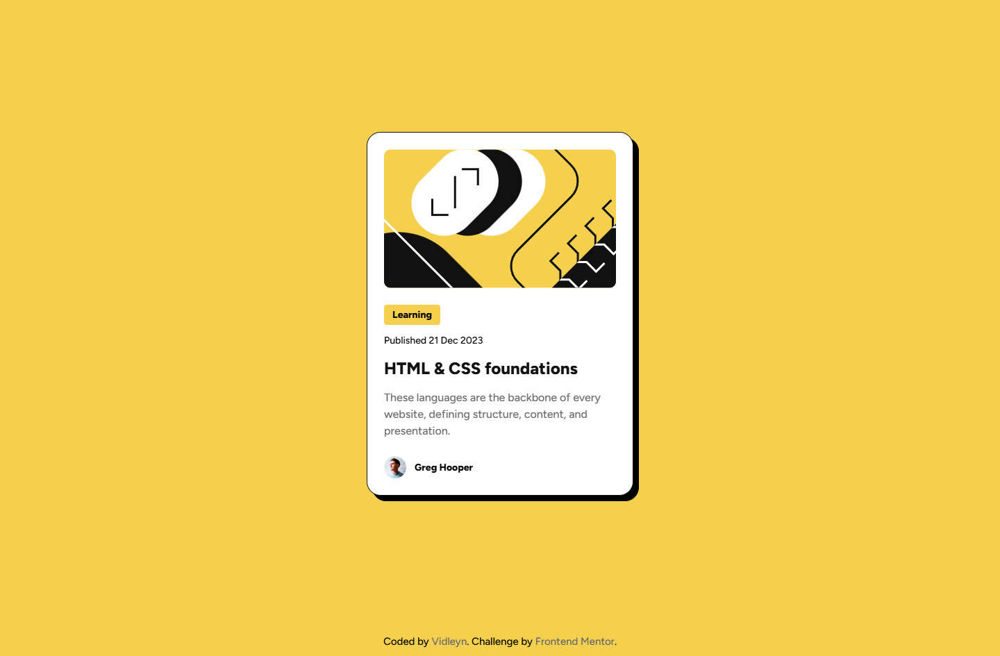

# Blog preview card - Frontend Mentor

This is a solution to the [Blog preview card challenge on Frontend Mentor](https://www.frontendmentor.io/challenges/blog-preview-card-ckPaj01IcS).

## Table of contents

- [Overview](#overview)
  - [The challenge](#the-challenge)
  - [Screenshot](#screenshot)
  - [Links](#links)
- [My process](#my-process)
  - [Built with](#built-with)
  - [What I learned](#what-i-learned)
  - [Continued development](#continued-development)
  - [Useful resources](#useful-resources)
- [Author](#author)

## Overview

### The challenge

Users should be able to:

- See hover and focus states for all interactive elements on the page

### Screenshot



### Links

- Solution URL: [Add solution URL here](https://your-solution-url.com)
- Live Site URL: [Add live site URL here](https://your-live-site-url.com)

## My process

### Built with

- HTML5
- SCSS

### What I learned

...

```html
<h1>Some HTML code I'm proud of</h1>
```

```css
.proud-of-this-css {
  color: papayawhip;
}
```

```js
const proudOfThisFunc = () => {
  console.log("🎉");
};
```

### Continued development

...

### Useful resources

- [Transfonter](https://transfonter.org/) - I use this tool to convert `.ttf` fonts into `.woff2` optimized file format in almost every project.
- [W3C Validator](https://validator.w3.org/) - A useful service to check the validity of HTML structure.

## Author

- Website - [Vidleyn](https://vidleyn.ru)
- Frontend Mentor - [@vidleyn](https://www.frontendmentor.io/profile/vidleyn)
- Telegram - [@davidleyn](https://t.me/davidleyn)
